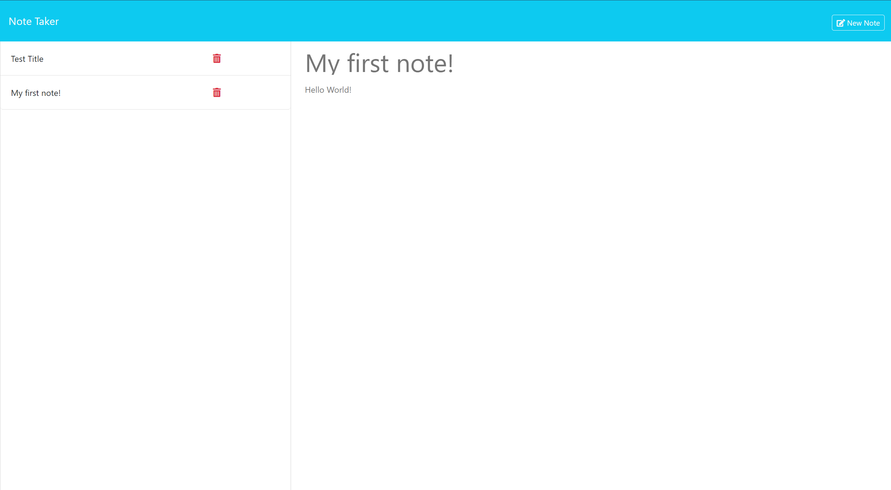

# 11 Express Note Taker

## User Story

```
AS A small business owner
I WANT to be able to write and save notes
SO THAT I can organize my thoughts and keep track of tasks I need to complete
```


## Acceptance Criteria

```
GIVEN a note-taking application
WHEN I open the Note Taker
THEN I am presented with a landing page with a link to a notes page
WHEN I click on the link to the notes page
THEN I am presented with a page with existing notes listed in the left-hand column, plus empty fields to enter a new note title and the note’s text in the right-hand column
WHEN I enter a new note title and the note’s text
THEN a Save icon appears in the navigation at the top of the page
WHEN I click on the Save icon
THEN the new note I have entered is saved and appears in the left-hand column with the other existing notes
WHEN I click on an existing note in the list in the left-hand column
THEN that note appears in the right-hand column
WHEN I click on the Write icon in the navigation at the top of the page
THEN I am presented with empty fields to enter a new note title and the note’s text in the right-hand column
```


## Objective

Using Express.js, create an application that will first prompt the user to click on a button regarding whether to create a new note. Once the button is clicked, a text field will be provided, prompting the user to enter in a note title with a note description. There will be a save button provided, in which once the user clicks 'Save', the note will be saved and stored. For a bonus, add functionality so that the user is also able to delete the note created.



## Live App Link
https://express-note-taker3-38445df5a0b6.herokuapp.com/

## How to Run

1. Run 'git clone (repo link)' on Git Bash'
2. CD into project directory
3. Run project via code editor (e.g. Visual Studio Code)
4. Open the terminal
5. Run 'npm install' to download all necessary dependencies
6. Run 'npm start' and open localhost:3001 to view running application
